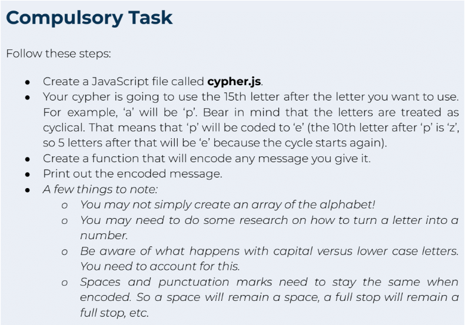

# Capstone Project 2 - Arrays, Functions and String Handling
My second capstone project came after we delved a bit deeper in JavaScript. We had covered while/for loops, defensive programming, arrays/maps, functions and string handling. This project was to take a sentence inputed by a user and return a coded version of the sentence in the console.

At this point of the bootcamp we had only covered JavaScript and very minimal HTML. As I want to show my journey I have left the HTML very basic please see my future projects to see what I can do with HTML/CSS.

## Task Specification
  